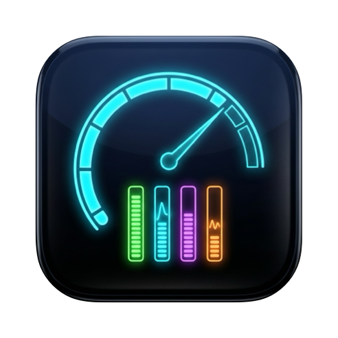
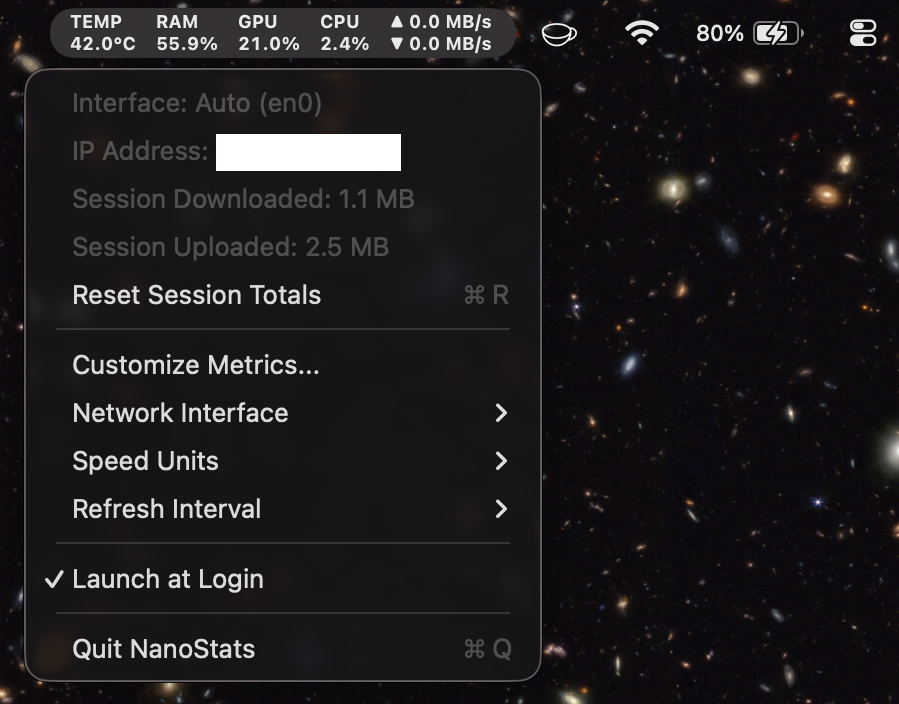

<p align="center">
  
</p>

<h1 align="center">NanoStats</h1>

<p align="center">
  A lightweight, zero-dependency macOS menu bar monitor
</p>

<p align="center">
  
</p>

## Features

- **Real-time Menu Bar Metrics** — Stacked indicators for upload/download speed, CPU %, GPU %, RAM %, and temperature
- **Drag-and-Drop Reordering** — Customize the order of metrics in the menu bar via a floating panel
- **Toggle Metrics** — Enable or disable individual metrics with checkboxes
- **Network Interface Selection** — Auto-detect or manually select a specific network interface
- **Speed Units** — Choose between fixed KB/s, MB/s, or Mbps units
- **Configurable Refresh Rate** — 0.5s, 1s, 2s, or 5s polling intervals
- **Session Totals** — Track cumulative upload/download data since launch
- **Launch at Login** — Native `SMAppService` integration (macOS 13+)
- **Invisible in Dock** — Runs as a pure menu bar accessory (`LSUIElement`)

## Requirements

- macOS 11.0 (Big Sur) or later
- Xcode Command Line Tools (`xcode-select --install`)
- Apple Silicon (arm64)
- Because the app is not notarized, remove the quarantine attribute
  before opening it and moving NanoStats.app to Applications:

```sh
xattr -d com.apple.quarantine ~/Downloads/NanoStats.dmg
```

## Building

For detailed instructions on building the macOS app bundle, creating a
`.dmg` installer, SPM development, and troubleshooting, see
[BUILD.md](BUILD.md).

```bash
# Quick build command
./build_app.sh
```

## Project Structure

```
Sources/NanoStats/
├── main.swift                  # App entry point
├── StatusBarController.swift   # Menu bar hub, preferences, menu setup
├── NetworkMonitor.swift        # Network I/O via getifaddrs / if_data
├── SystemMonitor.swift         # CPU, GPU, RAM, Thermal via host_statistics64 / IOKit
├── MetricComponent.swift       # MetricType enum with display names
├── IconProvider.swift          # Dynamic multi-metric image renderer
├── ReorderPanel.swift          # Drag-and-drop metric reorder panel
├── SpeedFormatter.swift        # Byte-rate formatting utilities
└── LaunchAtLogin.swift         # SMAppService wrapper
```

## How It Works

| Metric        | Source                                              |
| ------------- | --------------------------------------------------- |
| Network Speed | `getifaddrs()` + `if_data` (POSIX)                  |
| CPU Usage     | `host_statistics64` (`HOST_CPU_LOAD_INFO`)          |
| GPU Usage     | `IOKit` (`IOAccelerator` → `PerformanceStatistics`) |
| RAM Usage     | `host_statistics64` (`HOST_VM_INFO64`)              |
| Temperature   | `ProcessInfo.thermalState`                          |

## License

[MIT LICENSE](LICENSE)
